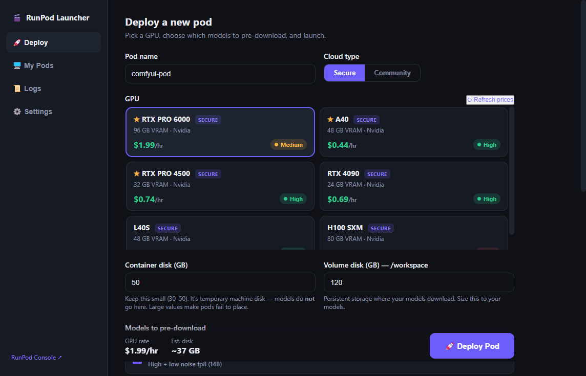
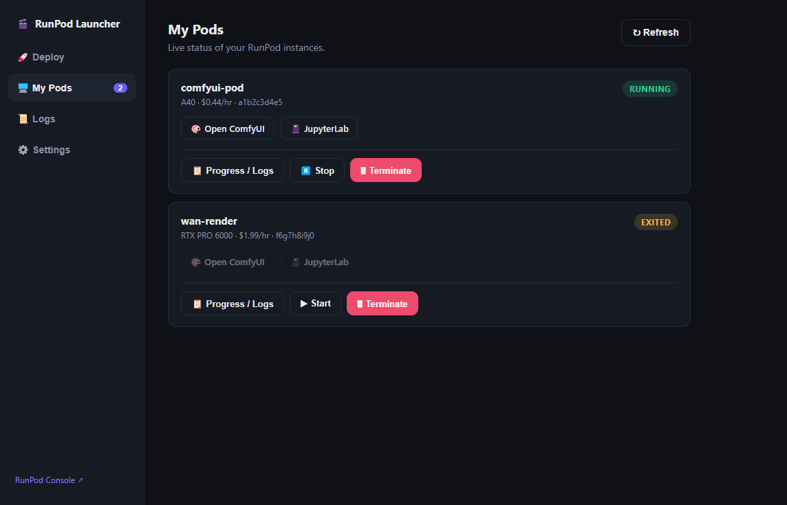
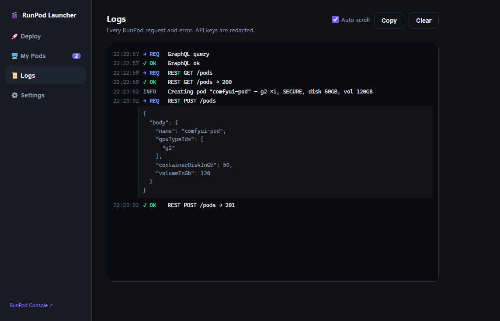
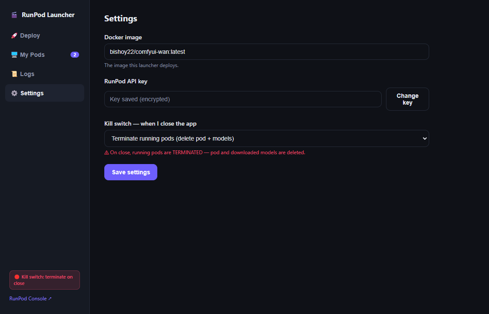

# ComfyUI RunPod Launcher

A friendly Windows desktop app to deploy a **ComfyUI GPU pod on RunPod** in one
click — pick a GPU with live pricing and availability, choose which AI models to
pre-download, launch, then open ComfyUI, watch progress, and stop or terminate
the pod. All from one window.


[](https://github.com/BISAM20/comfyui-runpod-launcher/releases/latest)

---

## Download

**[⬇ Download the latest installer](https://github.com/BISAM20/comfyui-runpod-launcher/releases/latest)**

Run `ComfyUI RunPod Launcher Setup.exe` and follow the installer. Because the app
is not yet code-signed, Windows SmartScreen may show a warning the first time —
click **More info → Run anyway**.

> Requires a [RunPod](https://runpod.io) account and an API key. The app runs
> locally on Windows 10/11; nothing is installed on your RunPod side beyond the
> pods you deploy.

---

## Screenshots

### Deploy — live GPU pricing & availability


### My Pods — status, links, and controls


### Logs — every request, with secrets redacted


### Settings — kill switch and defaults


---

## Features

- **Live GPU pricing & availability** — only shows GPUs that are actually
  available, with High / Medium / Low badges and per-hour prices pulled straight
  from RunPod. Favourite GPUs pin to the top.
- **One-click deploy** — name the pod, pick Secure or Community, choose which
  models to pre-download, and launch. Container-disk guardrails prevent the
  common "machine does not have the resources" placement failure.
- **Pod management** — live status, direct **Open ComfyUI** and **JupyterLab**
  links, and **Stop** / **Start** / **Terminate** controls.
- **Progress / Logs** — a per-pod panel with a boot timeline, ComfyUI-readiness
  probe, and streaming container logs (image boot + model-download progress).
- **App request log** — every RunPod API call and error, with API keys and
  tokens automatically redacted.
- **Kill switch** — optionally stop or terminate running pods when the app is
  closed so nothing is left billing (off by default).
- **Encrypted key storage** — the RunPod API key is stored encrypted on the
  local machine (Windows DPAPI) and is only ever sent to RunPod.

---

## Getting started

1. Create a RunPod API key at
   [console.runpod.io/user/settings](https://console.runpod.io/user/settings) →
   **API Keys** → **+ Create API Key** (read/write).
2. Launch the app and paste the key on the first screen.
3. **Deploy** tab — name the pod, pick a GPU, tick the models to pre-download,
   then **Deploy Pod**.
4. **My Pods** tab — when the pod shows `RUNNING`, click **Open ComfyUI**.

**Stop vs Terminate:** *Stop* pauses billing and keeps downloaded models on the
volume; *Terminate* deletes the pod and its models. The app confirms before
terminating.

---

## The Docker image it deploys

By default the launcher deploys `bishoy22/comfyui-wan:latest` — a self-contained
ComfyUI image (ComfyUI + 35 custom nodes + Wan / LTX workflows) that exposes:

| Port | Service |
|---|---|
| `8188` | ComfyUI |
| `8888` | JupyterLab |
| `8189` | Read-only log server (powers the in-app Progress / Logs panel) |

Models are downloaded on demand via `DOWNLOAD_*` environment variables the app
sets for you, and are stored on the pod's `/workspace` volume so they survive
Stop/Start. You can point the app at a different image in **Settings → Docker
image**.

---

## Build from source

Requires [Node.js](https://nodejs.org) (LTS).

```bash
npm install
npm start          # run in development
npm run dist       # build the Windows installer into release/
```

`npm run dist` produces `release/ComfyUI RunPod Launcher Setup <version>.exe`
(an NSIS installer). Double-clicking `Build Installer.bat` does the same.

### Project layout

| Path | Purpose |
|---|---|
| `electron/main.js` | Window, IPC, and all RunPod network calls (main process). |
| `electron/runpod.js` | RunPod client — REST for pods, GraphQL for GPU pricing. |
| `electron/store.js` | Encrypted API-key + settings storage. |
| `electron/logger.js` | In-app log bus with secret redaction. |
| `electron/preload.js` | Safe bridge exposed to the UI. |
| `renderer/` | UI — `index.html`, `styles.css`, `app.js`, `models.js`. |

To add or remove a downloadable model, edit `renderer/models.js` — one entry per
model, mapped to its `DOWNLOAD_*` flag.

---

## Notes

- The RunPod API key is stored encrypted locally and transmitted only to RunPod.
- The app is currently **unsigned**; a code-signing certificate would remove the
  Windows SmartScreen prompt.

## License

[MIT](LICENSE) © 2026 Bishoy
