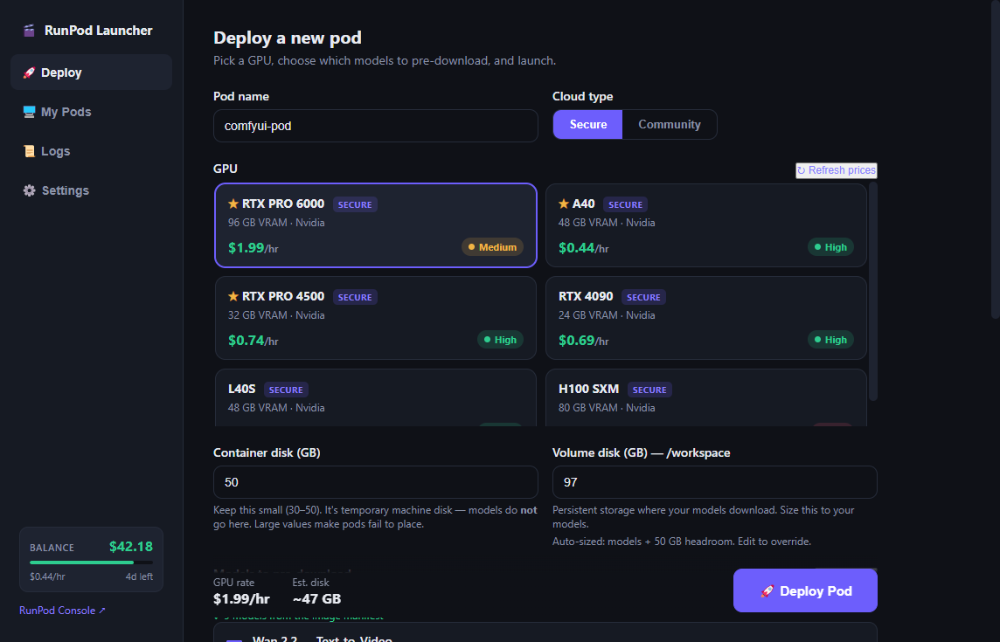
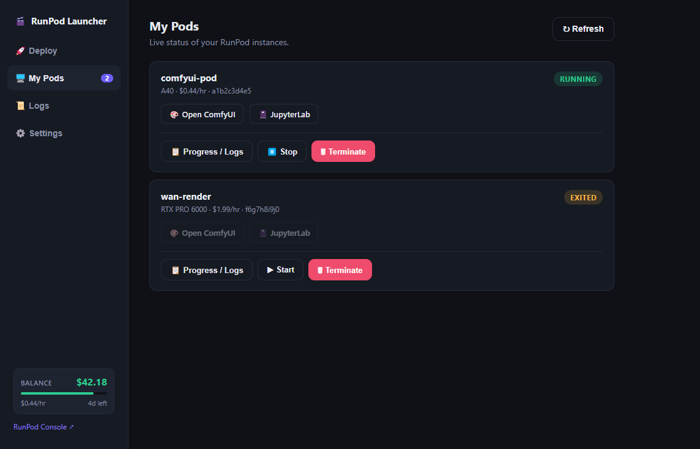
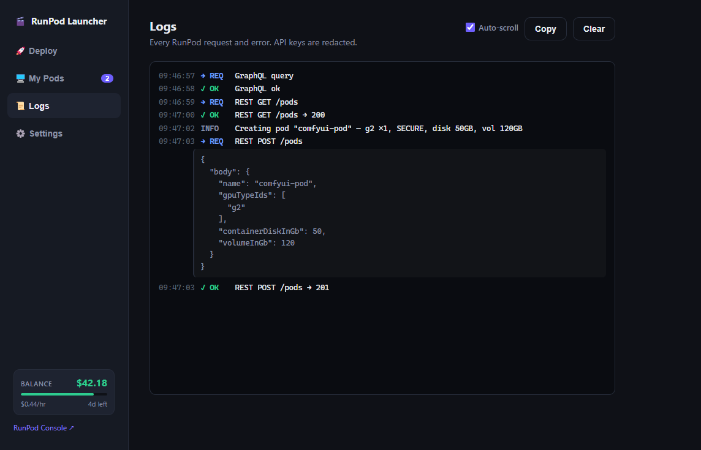
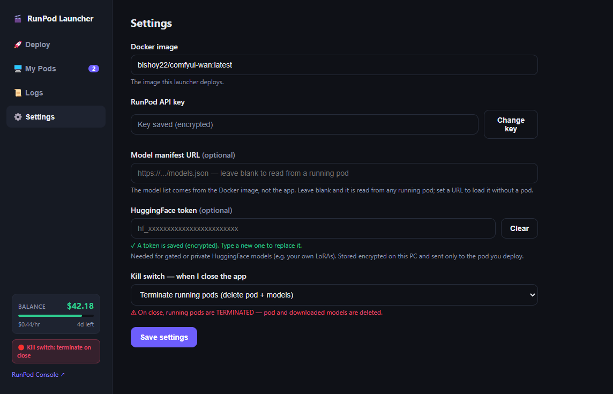

# ComfyUI RunPod Launcher

A friendly Windows desktop app to deploy a **ComfyUI GPU pod on RunPod** in one
click — pick a GPU with live pricing and availability, choose which AI models to
pre-download, launch, then open ComfyUI, watch progress, and stop or terminate
the pod. All from one window.


[](https://github.com/BISAM20/comfyui-runpod-launcher/releases/latest)

---

## Download

**[⬇ Download the latest installer](https://github.com/BISAM20/comfyui-runpod-launcher/releases/latest)**

Run `ComfyUI RunPod Launcher Setup.exe` and follow the installer. Because the app
is not yet code-signed, Windows SmartScreen may show a warning the first time —
click **More info → Run anyway**.

> Requires a [RunPod](https://runpod.io) account and an API key. The app runs
> locally on Windows 10/11; nothing is installed on your RunPod side beyond the
> pods you deploy.

---

## Screenshots

### Deploy — live GPU pricing & availability


### My Pods — status, links, and controls


### Logs — every request, with secrets redacted


### Settings — kill switch and defaults


---

## Features

- **Live GPU pricing & availability** — only shows GPUs that are actually
  available, with High / Medium / Low badges and per-hour prices pulled straight
  from RunPod. Favourite GPUs pin to the top.
- **Cost meter** — live account balance, hourly burn rate, and estimated runtime
  remaining, with clear warnings before you run out of credit.
- **One-click deploy** — name the pod, pick Secure or Community, choose which
  models to pre-download, and launch. Container-disk guardrails prevent the
  common "machine does not have the resources" placement failure.
- **Automatic volume sizing** — the volume disk is sized from the models you
  select, plus 50 GB of headroom. Override it any time.
- **Model list comes from the image** — the downloadable models are published by
  the Docker image itself, so pointing the app at a different image changes the
  list to match. Each pack can be expanded to show exactly which files and LoRAs
  it contains before you download it.
- **HuggingFace token** — saved encrypted for gated or private models.
- **Pod management** — live status, direct **Open ComfyUI** and **JupyterLab**
  links, and **Stop** / **Start** / **Terminate** controls.
- **Progress / Logs** — a per-pod panel with a boot timeline, ComfyUI-readiness
  probe, and streaming container logs (image boot + model-download progress).
- **App request log** — every RunPod API call and error, with API keys and
  tokens automatically redacted.
- **Kill switch** — optionally stop or terminate running pods when the app is
  closed so nothing is left billing (off by default).
- **Encrypted key storage** — the RunPod API key is stored encrypted on the
  local machine (Windows DPAPI) and is only ever sent to RunPod.

---

## Getting started

1. Create a RunPod API key at
   [console.runpod.io/user/settings](https://console.runpod.io/user/settings) →
   **API Keys** → **+ Create API Key** (read/write).
2. Launch the app and paste the key on the first screen.
3. **Deploy** tab — name the pod, pick a GPU, tick the models to pre-download,
   then **Deploy Pod**.
4. **My Pods** tab — when the pod shows `RUNNING`, click **Open ComfyUI**.

**Stop vs Terminate:** *Stop* pauses billing and keeps downloaded models on the
volume; *Terminate* deletes the pod and its models. The app confirms before
terminating.

---

## The Docker image it deploys

By default the launcher deploys `bishoy22/comfyui-wan:latest` — a self-contained
ComfyUI image (ComfyUI + 35 custom nodes + Wan / LTX workflows) that exposes:

| Port | Service |
|---|---|
| `8188` | ComfyUI |
| `8888` | JupyterLab |
| `8189` | Read-only log server (powers the in-app Progress / Logs panel) |

Models are downloaded on demand via `DOWNLOAD_*` environment variables the app
sets for you, and are stored on the pod's `/workspace` volume so they survive
Stop/Start. You can point the app at a different image in **Settings → Docker
image**.

### Model catalog (`models.json`)

The list of downloadable models is defined by the **image**, not the app — point
the app at a different image and the model list changes to match. The catalog is
resolved in this order, all before any pod exists:

1. **Manifest URL** — if one is set in **Settings → Model manifest URL**.
2. **The image on Docker Hub** — a `com.comfyui.models` label carrying the full
   catalog (names, descriptions, sizes). Images without that label still work:
   the app reads their `DOWNLOAD_*` environment variables and lists those, with
   sizes shown as unknown.
3. **A running pod** on the same image, which serves `models.json` on port 8189.

If none are reachable, the app falls back to a built-in list.

```json
{
  "models": [
    {
      "env": "DOWNLOAD_WAN22_T2V",
      "name": "Wan 2.2 — Text-to-Video",
      "desc": "High + low noise fp8 (14B)",
      "gb": 28.6,
      "items": [
        "wan2.2_t2v_high_noise_14B_fp8_scaled",
        "wan2.2_t2v_low_noise_14B_fp8_scaled"
      ]
    }
  ]
}
```

`items` is optional — when present, the app shows an expandable list so you can
see exactly which models and LoRAs a pack contains. `approx: true` marks a size
as an estimate.

Add a model to the image (a `DOWNLOAD_*` flag in `start.sh` plus an entry here),
run `node gen-label.js` to refresh the image label, rebuild, and it appears in
the app automatically.

---

## Build from source

Requires [Node.js](https://nodejs.org) (LTS).

```bash
npm install
npm start          # run in development
npm run dist       # build the Windows installer into release/
```

`npm run dist` produces `release/ComfyUI RunPod Launcher Setup <version>.exe`
(an NSIS installer). Double-clicking `Build Installer.bat` does the same.

### Project layout

| Path | Purpose |
|---|---|
| `electron/main.js` | Window, IPC, and all RunPod network calls (main process). |
| `electron/runpod.js` | RunPod client — REST for pods, GraphQL for GPU pricing. |
| `electron/store.js` | Encrypted API-key + settings storage. |
| `electron/logger.js` | In-app log bus with secret redaction. |
| `electron/preload.js` | Safe bridge exposed to the UI. |
| `renderer/` | UI — `index.html`, `styles.css`, `app.js`, `models.js`. |

`renderer/models.js` holds only the offline **fallback** catalog. The real model
list comes from the Docker image — see [Model catalog](#model-catalog-modelsjson)
above.

---

## Notes

- The RunPod API key is stored encrypted locally and transmitted only to RunPod.
- The app is currently **unsigned**; a code-signing certificate would remove the
  Windows SmartScreen prompt.

## License

[MIT](LICENSE) © 2026 Bishoy
